# Daniel Fernandes

**`Frontend Developer`**

React & TypeScript · Aveiro, Portugal

---

## 🧠 About Me

Frontend engineer focused on building **scalable web applications** with strong UX foundations.

I work primarily with **React and TypeScript**, designing complex dashboards.  
I value clean architecture, maintainability, and performance.

**Main Focus**
- React
- TypeScript
- Component Architecture
- Frontend Performance

---

## 🛠 Core Stack

---

### 📊 Estatísticas do GitHub

  
  

---

### 📫 Vamos nos conectar?

  
  

